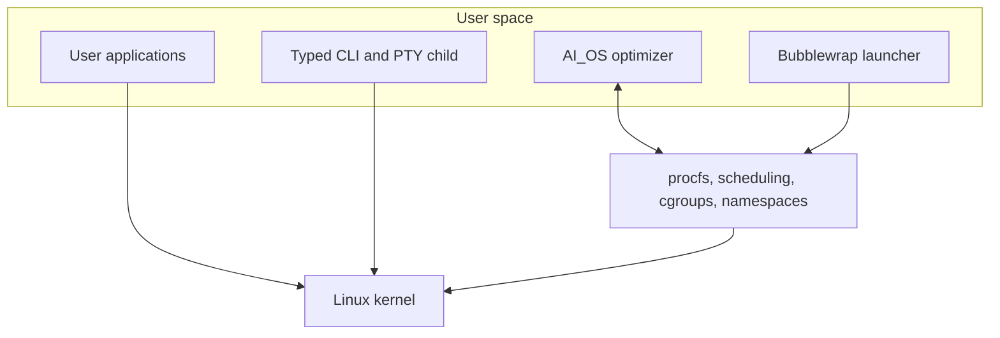
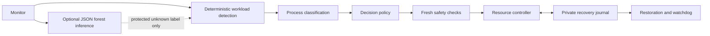

# AI_OS — Presentation Generation Brief

> Use this file to generate an editable presentation. It includes factual claims, slide content, visual directions, speaker notes, demo commands, and implementation references.
>
> Implementation brief updated **30 September 2026**. Validation reports contain measured results for the environment where they were generated. Copy test counts, skips, sandbox availability, and measurements only from a fresh report; do not reuse historical totals as current evidence.

## 1. Presentation instructions

Create 16 main slides for a 12–15 minute technical project presentation, followed by an optional appendix. The audience is university reviewers and engineers with basic Linux knowledge. Explain all three implemented components, their boundaries, ML's actual role, and a reproducible VM demonstration.

- Project: **AI_OS — AI-Assisted Linux System Management**.
- Presenter: `[Your Name]`; institution/team: `[Institution / Team]`; date: `[Presentation Date]`.
- Prefer an editable `.pptx`; otherwise supply slide content and speaker notes in order.
- Use 16:9 slides, readable 22–28 pt body text, and approximately 32–40 pt titles.
- Suggested palette: navy `#102033`, teal `#18A999`, pale gray `#F3F6FA`, white, and amber `#E9A23B` for limitations.
- Keep most slides to 3–4 short points. Use editable diagrams, timelines, and small comparison tables.
- Distinguish **implemented bounded demo**, **simulated Linux controls**, **measured environment result**, and **future work** with explicit labels.
- Do not invent screenshots, console output, model accuracy, speedups, test totals, or security guarantees.
- Never describe the system as production-ready, a kernel modification, an arbitrary-Bash safety checker, or supply-chain attack prevention.
- Retain material qualifications on slides; put supporting implementation details in notes.

## 2. Factual foundation

### What the project does

AI_OS is a **user-space management layer using existing Linux interfaces**. Applications continue to call Linux normally. AI_OS does not sit literally between every application and the kernel and does not insert code into the kernel.

All three components have bounded demonstrations:

| Component | Implemented behavior | Boundary |
|---|---|---|
| Process optimization | Monitoring, sustained workload detection, optional ML label refinement, explicit background policies, live safety checks, resource controllers, recovery journal | Observation by default; actual resource changes require explicit configuration and permission. The combined demo simulates Linux controls. |
| Natural-language CLI | Offline request mapping, immutable typed proposals, approval bound to exact proposal content, separate PTY-backed execution session | Finite read-only operations; no arbitrary shell commands. PTY separation is not filesystem isolation. |
| Artifact sandbox | Static inspection, private digest-addressed quarantine, explicit Python/POSIX-shell execution under bubblewrap, bounded reports | Capability probe required; unsupported isolation blocks execution. No proof of harmlessness or supply-chain prevention. |

### ML facts

- Snapshot feature extraction yields **31 numerical features**.
- Random Forest training is real; exported models contain only validated JSON data.
- Default operation does not require a model. Synthetic demo training is an explicit, separate workflow.
- ML may refine only a sustained, already protected `HEAVY_UNKNOWN` workload label at sufficient confidence.
- ML preserves deterministic activity, protection, confidence, timing, and safety authority. It cannot authorize process targets.
- Quiet NORMAL samples are collected despite zero deterministic confidence. Pending workload warmup is excluded from NORMAL labels.
- Evaluation uses the first 80% of chronological rows for training and the untouched final 20% for validation. No scaler is fitted across the split.
- Labels collected from deterministic decisions measure agreement with those rules, not independent user-intent ground truth.
- Synthetic fixtures deliberately contain separable application hints. Their scores demonstrate the pipeline, not real-world accuracy.

### Evidence rules

Run the verification workflow in the target VM and inspect [the validation report](VALIDATION_REPORT.md). The combined demo writes `artifacts/demo/report.json`; verification writes `artifacts/verification/report.json`. A successful unit test with a fake controller does not establish a successful live Linux resource change. An unavailable namespace facility must appear as a limitation, not be hidden as a successful sandbox demonstration. A sandbox probe passing in one environment does not establish support in another.

No controlled experiment currently establishes a real-workload speedup. The legacy benchmark measures observation overhead; classification accuracy and controller correctness are different from performance benefit.

## 3. Main slide deck

### Slide 1 — AI_OS: AI-Assisted Linux System Management

**Takeaway:** Three bounded components connect workload context and user intent to controlled Linux operations.

**On-slide content:**

- Workload-aware process optimization
- Natural-language requests with reviewed, typed operations
- Isolated artifact inspection and execution
- `[Your Name] · [Institution / Team]`

**Visual:** Three component cards above a Linux block; label all three “Implemented demo.”

**Speaker notes:** AI_OS runs in user space. The project demonstrates how context, reviewable operations, and isolation can support Linux management. The demonstration scope is deliberately smaller than a general operating system or a production security product.

### Slide 2 — The Problem: Resource Usage Is Not User Intent

**Takeaway:** High CPU usage may be useful work, while optional background activity can compete with it.

**On-slide content:**

- Compilation, rendering, and gaming can legitimately use substantial resources.
- Manual tuning requires process knowledge and careful restoration.
- Command syntax adds friction to simple system queries.
- Downloaded artifacts need inspection without immediate host execution.

**Visual:** A compilation task and an optional worker competing for CPU; label the compilation “Protect useful work.”

**Speaker notes:** The system must not infer that a process is unnecessary or malicious merely from high resource usage. Explicit user policy establishes which background applications may be managed.

### Slide 3 — Three Components, Three Explicit Boundaries

| Component | Demonstration | Boundary |
|---|---|---|
| Optimizer | Detect, protect, propose, apply through fake controls, restore | Host mutations require a separate explicit apply setup |
| Natural-language CLI | Request → proposal → approval → PTY output | Finite read-only operations |
| Sandbox | Inspect → quarantine → probe → isolated run → report | Requires working Linux isolation; otherwise blocks |

**Visual:** Three columns with a resource chart, terminal, and isolated box.

**Speaker notes:** These are separate responsibilities. The natural-language command validator is not the artifact sandbox. The combined demo makes simulated controls visible; it does not silently adjust desktop processes.

### Slide 4 — Where AI_OS Fits in Linux

**Takeaway:** Existing kernel interfaces provide observation and control.

**On-slide content:**

- Python services and tools in user space
- `psutil`, `/proc`, and pressure metrics for observation
- Scheduling interfaces and delegated cgroups for controls
- Bubblewrap and Linux namespaces for the sandbox



**Speaker notes:** “AI layer” describes a logical management function. Applications continue using Linux directly. No kernel modification or mandatory application interception is implemented.

### Slide 5 — Protect Useful Work Before Managing Background Tasks

**Takeaway:** Anomaly detection and background eligibility answer different questions.

| Question | Evidence used |
|---|---|
| Is substantial user work active? | Measured activity sustained over time |
| Which processes belong to it? | Ownership, process identities, ancestry, explicit foreground context |
| May a background process be changed? | Exact executable opt-in and deterministic policy |
| Is an action appropriate now? | Fresh live checks, contention, authorization, restoration feasibility |

**Speaker notes:** The legacy anomaly model does not grant control authority. Unknown, inaccessible, critical, foreground, and other-user processes receive conservative treatment.

### Slide 6 — The Optimizer Pipeline

**Takeaway:** Recognition, authorization, control, and recovery have separate responsibilities.



**On-slide content:**

- Observe by default; opt in to background targets.
- Protect sustained user workloads.
- Journal before changes; recheck live identity.
- Restore when conditions change.

**Speaker notes:** The actual controller supports configured scheduling changes, delegated cgroup controls, and exceptional explicitly enabled suspension. The demonstration uses a fake Linux backend to exercise the decision and recovery path without claiming host changes occurred.

### Slide 7 — Recognition Needs Activity and Time

**Takeaway:** An executable name is a hint, not sufficient evidence of heavy work.

**On-slide content:**

- Resource signals: CPU, RAM, I/O, load, pressure
- Context: executable, owner, parent, process start time
- Sustained activation and quiet-release hysteresis
- Protected process identities survive brief workload dips

**Visual:** A conceptual timeline: NORMAL → brief spike → NORMAL → sustained work → active workload → quiet release.

**Speaker notes:** Default activation and release durations are approximately 15 and 20 seconds. Initial counters require priming. The scripted demo may use shorter configured durations; identify them as demo settings. Labels include NORMAL, DEVELOPMENT, COMPILATION, GAMING, EDITING, AI_ML, and HEAVY_UNKNOWN.

### Slide 8 — ML Adds a Bounded Recognition Role

**Takeaway:** A trained model may improve the workload label without expanding control authority.

**On-slide content:**

- 31 snapshot features → Random Forest probabilities
- Only protected, sustained `HEAVY_UNKNOWN` can be refined
- Confidence threshold: at least 0.85
- Eligibility, protection, timing, and resource decisions stay deterministic

**Visual:** Two paths: deterministic authorization as a solid line; ML label refinement as a dotted branch.

**Speaker notes:** ML does not activate work early, boost deterministic confidence, or select targets. Predictions that disagree with an already recognized workload remain advisory metadata. Model or collection errors are isolated so deterministic optimization can continue. Without a model, the baseline still works.

### Slide 9 — Training and Honest Evaluation

**Takeaway:** A real training pipeline does not make a synthetic score real-world evidence.

**On-slide content:**

- Reproducible synthetic fixture: seven classes, explicitly labeled
- Chronological training/holdout split: 80% / 20%
- Reject invalid data, missing classes, and inadequate validation scores
- Separate future evaluation on manually reviewed real workload sessions

**Speaker notes:** The default fixture generates 700 samples, 100 for each class. These are generated inputs, not observed users or application sessions. The model needs at least 100 rows, at least two classes, at least 20 rows for each class, and representation of every class in both partitions. A validation score below 0.60, including zero or NaN, cannot promote a model. `cv_accuracy` is a compatibility field name for chronological holdout accuracy. No real-world score should be inferred from fixture results.

### Slide 10 — Model Files Are Data, Not Executable Pickles

**Takeaway:** Persistence is part of the ML boundary.

**On-slide content:**

- Validated JSON forest with exact feature schema
- Bounded trees, depth, file size, and finite probabilities
- Private atomic writes and file ownership checks
- Legacy pickle/joblib models are ignored without deserialization

**Speaker notes:** Training uses one worker. The default forest has 80 trees and depth 10; accepted settings are bounded at 150 trees and depth 12. The CSV collector validates labels and features, caps retained rows, and tracks ingestion independently of retention. Failed training attempts have retry backoff. Shutdown joins training through `close()`.

### Slide 11 — Natural Language to a Reviewed PTY Operation

**Takeaway:** The CLI executes a small operation vocabulary instead of accepting arbitrary Bash.

```text
Offline request → immutable typed proposal → exact-content approval
                → independent validation → PTY child → bounded output
```

**On-slide content:**

- CPU, memory, disk, process, and system summaries
- Working-directory display, bounded file listing/search
- Explicit approval bound to proposal content
- Timeout, cancellation, output limits, child cleanup

**Speaker notes:** The offline path needs no API key. The optional online classifier can only select from the same operations; generated shell code is not accepted. File queries do not read file contents. No writes, deletion, root operations, redirects, substitutions, or general shell pipelines are accepted. A dedicated PTY/session supports terminal behavior but does not provide kernel filesystem isolation. `--yes` is explicit approval of a single `-c` request, not blanket REPL approval.

### Slide 12 — Artifact Sandbox: Inspect, Isolate, Report

**Takeaway:** Execution requires a successful isolation probe and produces bounded observations.

```text
Local artifact → static inspection → private quarantine
               → capability probe → explicit isolated script run → JSON report
```

**On-slide content:**

- SHA-256, file type, and heuristic static indicators
- Bubblewrap namespaces; read-only runtime and isolated temporary workspace
- Wall timeout, per-process resource limits, bounded output
- No host-execution fallback if isolation is unavailable

**Speaker notes:** Supported execution is limited to Python and POSIX shell scripts. Other formats can be inspected. The sandbox hides host home/project/environment and host `/etc`, isolates the network, drops capabilities, and exports only output/report data. Runtime trees remain visible. There are no aggregate memory/disk quotas, seccomp filtering, comprehensive malware verdicts, or kernel-exploit protection. A clean report means only that the described checks observed no issue. It cannot establish supply-chain safety or justify running hostile samples on a workstation.

### Slide 13 — Recovery Is an Explicit System Behavior

**Takeaway:** Resource changes require identity checks and a restoration plan.

**On-slide content:**

- Bind targets to PID, start time, executable, and owner.
- Persist original state before applying a change.
- Restore after workload completion, shutdown, or recovery.
- Preserve unresolved journal records for investigation.

**Visual:** Validate → journal → apply → observe → restore, with an independent recovery worker.

**Speaker notes:** The pipeline checks foreground protection and restoration feasibility. Nice changes are refused when restoration is not permitted. Recovery depends on process identity, permissions, available cgroups, and a surviving watchdog or later restart. It cannot guarantee restoration after every external system change.

### Slide 14 — A Reproducible VM Demonstration

**Takeaway:** Preflight, demonstrate, and verify in the same disposable VM.

**Slide-ready commands, from the repository root:**

```bash
.venv/bin/python doctor.py
.venv/bin/python demo.py
.venv/bin/python scripts/verify.py --require-sandbox
```

**On-slide content:**

- Follow `docs/VM_DEMO_GUIDE.md` for environment setup.
- Show optimizer decisions with simulated Linux controls.
- Show a reviewed offline CLI operation and isolated benign script.
- Preserve the generated validation report and inspect failures/skips.

**Speaker notes:** Run preflight first. The combined demo makes simulated controls and synthetic ML data visible. The required-sandbox verification is the acceptance command for a VM demonstration that claims all three components executed. If namespace setup is denied, retain the blocked result and fix the VM prerequisite through its administrator; do not imply isolation succeeded. Run only owned, harmless example artifacts.

### Slide 15 — Evidence, Limits, and Next Experiments

**Takeaway:** Current reports establish tested behavior within their stated environment.

**On-slide content:**

- Fresh validation report: measured results, failures, skips, environment
- Unit and integration checks cover safety boundaries and lifecycle behavior
- No established real-workload speedup or independent ML generalization result
- Next: controlled VM action experiments and reviewed session datasets

**Visual:** Three evidence cards: “Verified in report,” “Simulated,” and “Not yet measured.” Populate numbers only after reading the generated report.

**Speaker notes:** Avoid displaying historical test totals. Canonical `src.*` imports and current CLI integration replace the older mixed-import implementation. Do not present previously recorded defects as open without reproducing them. Remaining work includes controlled live resource experiments, GPU telemetry, desktop focus integration, and more representative ML evaluation.

### Slide 16 — Discussion: What Evidence Should Come Next?

**Takeaway:** The project now has three usable bounded demos and explicit authority boundaries.

**On-slide content:**

- Deterministic protection and explicit opt-in for optimization
- Typed, reviewed operations for natural-language interaction
- Capability-gated isolation for script experiments
- Next milestone: independently measured benefit and broader VM validation

**Discussion prompt:** Which workload and success metric should the next controlled experiment use?

**Speaker notes:** Examples include compilation completion time under known background contention, foreground responsiveness, manager overhead, successful restoration, and repeatability. These are proposed experiments, not achieved results.

## 4. Technical appendix

### A. Individual component demonstration commands

Run from the repository root after setting up the project environment. Commands that execute an operation or example are intentional demonstrations; run them only in the prepared VM.

```bash
# Read-only host observation; do not imply a one-shot run proves sustained detection.
.venv/bin/python main.py --once --no-ml

# Separate, explicitly synthetic model and dataset; does not install a production model.
.venv/bin/python scripts/train_demo_model.py --output-dir /tmp/ai-os-ml-demo --seed 42

# Offline typed request with explicit approval of this single command.
.venv/bin/python -m nli.cli_interface --offline --yes -c 'system summary'

# Non-executing artifact inspection, isolation preflight, then explicit benign execution.
.venv/bin/python -m sandbox.cli inspect examples/sandbox/isolation_demo.py
.venv/bin/python -m sandbox.cli doctor
.venv/bin/python -m sandbox.cli run examples/sandbox/isolation_demo.py --timeout 5
```

Use the VM guide and each command's `--help` for available output/report options. Do not run the isolation-probe example directly on the host. Do not switch the optimizer to `--apply` merely to make a presentation look active; configure a dedicated background workload, policy, permissions, and recovery experiment first.

### B. Feature and evaluation summary

| Group | Count | Examples |
|---|---:|---|
| System | 9 | CPU, memory, load, disk rates, pressure |
| Process aggregates | 14 | Counts, totals, maxima, CPU shares, threads |
| Application hints | 5 | ML, compilation, gaming, editing, development |
| Process tree | 3 | Depth, width, root count |

Current features describe individual snapshots. Predicted probabilities have not been independently shown to be calibrated. Chronological separation avoids fitting preprocessing to held-out rows but does not establish independence between neighboring snapshots of a long session. Manually reviewed, session-separated real captures remain necessary for broader claims.

### C. Questions and defensible answers

**Does this modify the Linux kernel?** No. It uses existing Linux interfaces from user space.

**Is there a trained model?** The explicit demo training command produces a real fitted Random Forest exported as JSON from synthetic fixture data. Normal manager operation does not require or automatically select that demo model. Check the current model configuration before claiming predictions are active.

**What can ML change?** Only the recognized label of an already sustained, protected unknown workload, subject to confidence gating. It cannot authorize resource targets or weaken protection.

**Can the CLI safely execute any Bash command?** No. It accepts a fixed read-only operation set, validates exact arguments, binds approval to the proposal, and runs it through a bounded PTY execution path.

**Does the sandbox prevent supply-chain attacks?** No. It provides local static inspection, quarantine, and bounded isolated script experiments. A finite observation does not prove an artifact, installer, dependency, or application harmless.

**What if isolation is unavailable?** Execution is blocked and the reason is reported. There is no host-execution fallback.

**What if the optimizer crashes?** A recovery worker can replay the journal; a later restart or explicit recovery can address remaining records. Permissions and external state can prevent automatic restoration.

**How much faster is the machine?** No defensible general speedup is established. Controlled real-workload experiments are still required.

### D. Presentation review checklist

- [ ] Place AI_OS in user space; no literal kernel insertion claim.
- [ ] Show all three implemented components and their distinct boundaries.
- [ ] Label fake Linux controls and synthetic training data visibly.
- [ ] Describe ML's current bounded label refinement; omit obsolete confidence boosts and early activation claims.
- [ ] Describe finite typed CLI operations, approval, and PTY limits.
- [ ] Describe bubblewrap capability checks and blocked execution accurately.
- [ ] Copy results only from the current validation report, including skips and environment limitations.
- [ ] Do not claim real-world accuracy, speedups, production readiness, or supply-chain prevention.
- [ ] Keep presenter and institution fields editable.

## 5. Repository references

- [README](../README.md): current project entrypoint and component status.
- [VM demonstration guide](VM_DEMO_GUIDE.md): setup, commands, and acceptance workflow.
- [Validation report](VALIDATION_REPORT.md): measured results and environment-specific limitations; confirm it matches the latest run.
- [ML guide](ml-guide.md): model semantics, safe JSON format, training, and synthetic fixture scope.
- [CLI guide](cli-guide.md): operations, approval, PTY behavior, and optional provider setup.
- [Sandbox guide](sandbox-guide.md): isolation layout, resource limits, reports, and environment troubleshooting.
- `doctor.py`, `demo.py`, `scripts/verify.py`: reproducible preflight, demonstration, and verification entrypoints.
- `main.py`, `src/optimization/`, `src/controller/`: observation, policies, control, and recovery.
- `src/ai/`, `scripts/train_demo_model.py`: feature extraction, strict collection, chronological training, JSON inference.
- `nli/`, `sandbox/`, `tests/`: component implementations and regression checks.

Historical memory entries and earlier implementation reports remain useful development history. When they conflict with current behavior, verify the current source, component guides, and fresh validation report before presenting a claim.
