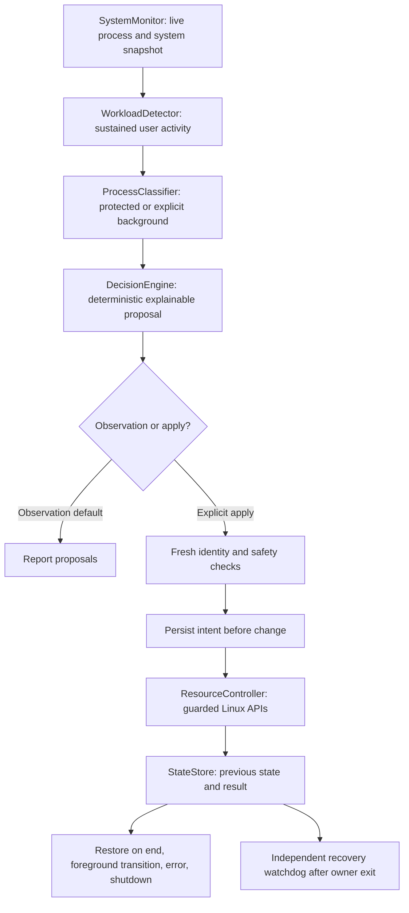

# Component 1 implementation report

Reviewed and implemented on 2026-09-17. Scope: process optimization only. No kernel
patches, NLI integration, sandbox work, service installation, or host resource changes.

## Starting point and reuse

The repository had a psutil collector, a bounded CSV logger, a three-feature
Isolation Forest, and a controller that reniced historical anomalous PID rows.
The five existing test modules imported removed files. NLI code and user changes
in settings/README were present before this work.

Reused the existing `monitor`, `controller`, `config`, and `utils` package layout,
psutil dependency, centralized logger, metrics CSV schema, CSV synchronization,
and bounded optional telemetry. The existing Isolation Forest and model files are
preserved as offline experiments; anomaly scores have no control authority.

Replaced the three asynchronous collect/score/enforce loops with an ordered live
pipeline. The PID-only and historical-CSV controller entry points now fail closed.
Replaced outdated tests instead of recreating deleted APIs merely to satisfy them.
Fixed CSV retention/counting for names containing newlines and made truncation atomic.

## Current architecture

No new agent framework runs in AI_OS. Development used the requested specialist
roles in waves: the root Orchestrator coordinated three reusable agent workers
across Monitor, Workload, Classification, Decision, Controller, State/Recovery,
Safety, and Tester responsibilities, within the environment's agent limit.

## Detection

A persistent monitor instance samples all visible processes without sleeping per
process, priming new CPU/IO counters safely. It records CPU, RAM, load, disk IO
rates, optional PSI, PID/start time, parent, UID, executable, command arguments,
status, nice, thread count, process IO, and cgroup path. Inaccessible metadata
makes a process ineligible; broad sampling failures invalidate the snapshot.

The detector combines measured process-tree CPU/memory/IO with system pressure,
known executable/command hints, foreground information, and duration. Labels are
NORMAL, DEVELOPMENT, COMPILATION, GAMING, EDITING, AI_ML, or HEAVY_UNKNOWN. Names
alone do not activate a workload. Default sustain is 15 seconds; quiet release is
20 seconds with lower retention thresholds to reduce oscillation. Identities keep
PID reuse from inheriting workload history. Explicit background executables and
their descendants cannot establish the foreground workload by themselves.

Workload descendants and required ancestors are protected. Ancestors are never
expanded back into unrelated sibling branches. Unattributed system pressure may
be HEAVY_UNKNOWN, but has no protected user work and cannot authorize intervention.

## Classification and decisions

Categories: CRITICAL_SYSTEM, USER_FOREGROUND, USER_IMPORTANT, BACKGROUND_SAFE,
BACKGROUND_OPTIONAL, UNKNOWN, and observational SUSPICIOUS. Suspicious means
"requires inspection", not a malware verdict or permission to act.

Background categories require exact absolute executable policy matches. Root,
other-user, mixed-UID privileged, inaccessible, protected, or uncertain processes
cannot be opted in. Unknown processes produce NOOP. Critical service names add
protection alongside UID, kernel-thread, parent, executable, cgroup, foreground,
and process-tree checks. Idle stopped targets remain classifiable for existing
suspension recovery, but stopped processes never receive a new optimization.

The decision engine requires an active protected user workload, confidence, actual
resource pressure, and meaningful target resource usage. Default RENICE lowers
CPU priority to an absolute target and never increases priority. Stronger strategies
are available only through explicit policy; there is no automatic escalation.
CPU_LIMIT/CGROUP use delegated cgroup v2 cpu.max; CGROUP can also use memory.high
with 25% RSS headroom. Memory-only contention does not trigger ineffective renicing.
SUSPEND requires both policy and runtime permission, BACKGROUND_OPTIONAL, ordinary
status, no children, and no recorded IO activity/history. No strategy kills tasks.

## Execution and recovery

The controller rechecks live PID, creation time, executable, ownership, protections,
status, terminal foreground relatives, and applicable resource conditions before
mutation. Renice refuses to proceed without the ability to restore the target's
original priority, using CAP_SYS_NICE or the target's RLIMIT_NICE. Linux nice changes
apply to the process leader; cgroups are the supported strategy for whole groups.

State records contain identity, executable, original nice/cgroup/status, action,
time, workload, boot ID, intended changes, phase, and failures. Strict schema and
action-specific validation reject malformed recovery instructions. Files are
private, symlinks rejected, replacements atomic, writes/fsync checked, and flock
held across the full controller lifetime. Pending intent is persisted before every
resource write. A persistence failure stops further optimization and allows recovery
to reopen state after the owner releases the lock.

Restoration occurs after workload release, when a target becomes foreground or
important, on invalid telemetry, on shutdown, and before startup applies new work.
An independently running process waits on a parent-lifetime pipe. EOF after owner
exit or SIGKILL triggers journal recovery; the parent requires a ready acknowledgement
before changing processes. The watchdog retries unresolved actions. Manual recovery
uses `main.py --recover` with the original state path and cgroup root.

A new boot invalidates old process records. An exited/reused PID is not acted on.
An executable/owner change, external nice change, lost permission, or unavailable
source group leaves a visible unresolved record. Recovery never guesses a different
process's prior state. Cgroup recovery also restores children born in its owned
group, even if the original process has exited, then removes the empty group.

## Files created

| Area | Files |
|---|---|
| Shared contracts and configuration | `src/optimization/__init__.py`, `models.py`, `config.py` |
| Workload/policy/safety | `src/optimization/workload.py`, `classification.py`, `decisions.py`, `safety.py` |
| Orchestration and recovery | `src/optimization/engine.py`, `state.py`, `recovery.py` |
| Linux controls | `src/controller/cgroups.py` |
| Examples/documentation | `examples/optimizer-policy.json`, `deploy/ai-os-optimizer.service.example`, this report |
| Tests | `tests/test_workload.py`, `test_classification.py`, `test_decisions.py`, `test_state.py`, `test_resource_controller.py`, `test_cgroups.py`, `test_safety_audit.py`, `test_config.py`, `test_recovery.py`, `test_cli.py` |

## Files modified

- `main.py`: default observation CLI, ordered pipeline, explicit apply/recover modes,
  identity-pinned foreground selection, watchdog and shutdown integration.
- `src/monitor/metrics_collector.py`: structured low-overhead live sampling; legacy
  CSV adapter retained.
- `src/monitor/data_logger.py`: count/retain logical CSV records and atomic retention.
- `src/controller/process_controller.py`: journaled guarded controller replaces
  anomaly-driven PID-only actions.
- `src/config/settings.py`: optimizer defaults added, existing NLI settings preserved.
- `README.md`: current setup, architecture, policies, controls, recovery and limits.
- Existing tests `test_monitor.py`, `test_ai_detector.py`, `test_controller_safety.py`,
  `test_data_logger.py`, `test_system_flow.py`: rewritten around current modules.

No source files were deleted; unsafe controller entry points remain only as explicit
errors. Existing NLI files, `.env`, persisted models/data, and requirements were not
modified. Tests and smoke runs append ordinary ignored runtime logs.

## Verification

Final command: `.venv/bin/python -B -m pytest -q -p no:cacheprovider`.
Result: **348 tests passed**. A separate observation smoke run of
`.venv/bin/python -B main.py --once` exits successfully with NORMAL and no proposals.

Coverage includes monitor counter priming and rates, protected process categories,
all workload labels and hysteresis, resource pressure policy, apply/restoration,
PID reuse/exit, permission failures, failed journal writes, lock conflicts, malformed
state/config, retained suspension, foreground transitions, cgroup limits/descendants,
and CLI fail-closed paths. Recovery pipe EOF is exercised with a disposable parent
process terminated by the test; journal replay and mutations use fake Linux backends.
The real watchdog also runs against an empty temporary journal.

No test renices, suspends, or migrates production processes or writes host cgroups.
These results verify implementation behavior, not performance improvements or a
proof of safety under all concurrent OS state changes.

## Remaining limitations

1. GUI active-window discovery and GPU telemetry are absent. Select an application
   using `--foreground-pid` until a desktop adapter is available.
2. Rules are conservative, not a trained user-intent model. Users must explicitly
   designate background executables. Shared interpreters are poor opt-in targets.
3. Cgroup operations require an already-delegated, enabled subtree owned by the
   acting user; targets and their original groups must be inside it. There is no
   automatic service migration, delegation, or cgroup controller activation.
4. Numeric Linux PID operations have narrow check/action races. Cgroup writes check
   identity before and after but Linux provides no atomic start-time-bound
   cgroup.procs write. Do not describe this as an absolute race-free guarantee.
5. Nice is per-thread on Linux; changing a process leader does not cover all threads,
   and future children may inherit nice. This implementation does not track every
   fork to undo inherited nice. Use cgroups for forking worker applications.
6. Suspension cannot prove absence of locks/external dependencies. Keep it disabled
   except for an explicitly understood disposable/background task.
7. Watchdog recovery requires a surviving worker or a later restart/manual recovery.
   External permission changes, destroyed cgroups, executable changes, storage
   failures, or stopping both processes may require operator intervention.
8. The optional legacy Isolation Forest retains its old offline dataset/retraining
   semantics; it is not in the live control pipeline. No live adaptive learning is
   claimed.
9. IO pressure is monitored; there is no io.max or GPU resource controller. Soft
   memory ceilings are conservative and do not promise immediate RAM reclamation.
10. Privileged behavior and cgroup deployment have only mocked validation here.
    The systemd template is provided for review, not installed or enabled.

## Next development step

Run an isolated Linux VM with one explicitly opted-in worker and one compilation
workload. Validate delegated cgroups, permissions, restoration after Ctrl+C/SIGKILL,
and foreground transitions, then measure build duration, interactive latency,
resource pressure, and AI_OS CPU/RAM overhead against an unmanaged baseline. Keep
live deployment opt-in until the benchmark shows a useful improvement without
regressions. Only then broaden application policies or add learned workload hints.
